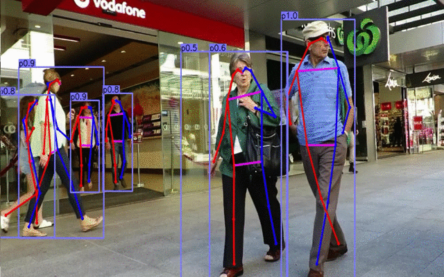
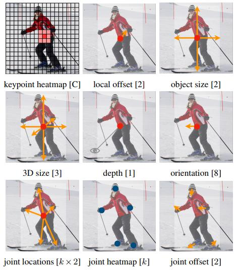

# CenterNet-keypoints

Centernet is a very useful single-shot & anchor-free mothed, perform well with all computer vision task.

This is a Keypoints detection(pose estimation) version support pytorch 1.3, original implementation is [here](https://github.com/xingyizhou/CenterNet).


**Notes:** This implementation relay on the DCNV2(deformable-convolutional-networks
cnn) which is done by [https://github.com/CharlesShang/DCNv2](https://github.com/CharlesShang/DCNv2).

If you use conda, it maybe not work, CUDA_HOME should be set locally.

For now, this project hidden the weights document, please train by yourself **(1 rtx 2080ti trained by 6 days, batch_size=4)**. 



## CenterNet Models

this project modified CenterNet Object-as-Points, just add 2 channels of offsize branch, MS COCO have 17 types keypoints, so offsize has 17*2+2 = 36 channels. HeatMap channels are 1+17 = 18.



## Run

make sure you have those requirements:

```
torch
pytorch 1.0
python 3.7
cuda 10.0

sudo pip3 install alfred-py
sudo pip3 install absl-py
```

to run a demo, simply:

```
# build DLA extension first
./make.sh

# change video path inside demo_det.sh
./demo_pose_det.sh path/to/video.mp4(jpeg...)
```

then it will do inference on video.
Here is a result on 3D object detection on single image:

## Train

Training instructions:


    1. To train a detection model, we encourage uses training start with coco. Once you successfully training on coco, you can train it on any other dataset.

    ```
    ./train_coco_r101.sh
    ```

    this will start training resnet101 model. You should also soft link your coco root under `data`.

    ```
    the annotations converts to coco like this:
    ```json
    {
        "annotations": [{"image_id": 0, "id": 1, "category_id": 1, "dim": [1.89, 0.48, 1.2], "bbox": [712.4, 143.0, 98.33000000000004, 164.92000000000002], "depth": 8.41, "alpha": -0.2, "truncated": 0, "occluded": 0, "location": [1.84, 1.47, 8.41], "rotation_y": 0.01}
    }
    ```


to train CenterNet on custom datasets. simple write a dataset like coco.
